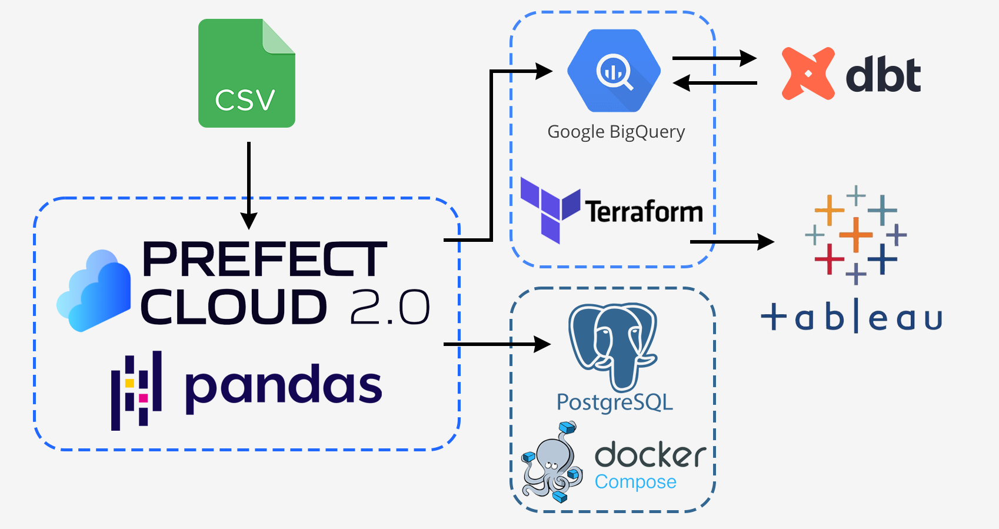

## Project Description
This project is an ETL pipeline with dbt tuning designed for complex chess analytics. The steps include:
- Extract the chess game data from a csv file
- Filter, clean, reshape the dataframe with pandas
- Parse the [chess notation](https://en.wikipedia.org/wiki/Algebraic_notation_(chess)) field into a new dataframe
- Load the dataframes into Postgres and BigQuery
- Run dbt models and tests on the BigQuery data
- Visualise the data using Tableau

Download the original dataset: https://www.kaggle.com/datasets/arevel/chess-games

TODO: Follow the instructions to run the pipeline on your own.

### About dataset
The dataset contains 6.25 million chess games played on [lichess.org](https://lichess.org/) in July 2016. This project used the only 265,000 games because of Tableau Public row limitation. However, the performance problem was one of the most challenging. In order to get all the moves in a separate dataframe, you have to iterate up to 92 times for each game.

## Used technologies
- Containerisation: `Docker Compose`
- Infrastructure as Code: `Terraform`
- Orchestration: `Prefect Cloud`
- Data transformation: `pandas`, `dbt cloud`
- Data warehouse: `BigQuery`
- Visualisation: `Tableau`

## Dashboard
Link: https://public.tableau.com/views/ChessAnalytics/1_PieceUsage

